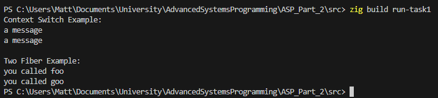
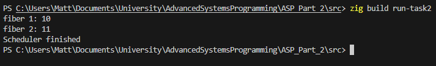
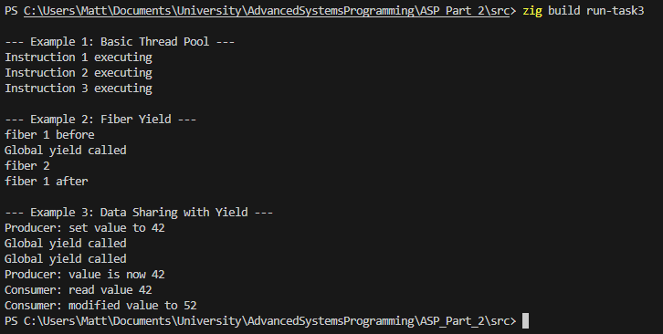

# Advanced Systems Programming

## Building and Running

### Prerequisites
- Zig 0.15.2 or later
- Windows x64 (or modify assembly for other platforms)

### Build Commands

```powershell
# Build all tasks
zig build

# Run Task 1 (Context Switching)
zig build run-task1

# Run Task 2 (Fiber Scheduler)
zig build run-task2

# Run Task 3 (Fiber Yield Support)
zig build run-task3
```

## Task 1

Task one involves simply demonstrating context switching between fibers.

```// Basic context switching example with volatile variable
pub fn context_switch_example() void {
    var x: u32 = 0;
    var c: context.Context = undefined;

    _ = context.get(&c); // Save context here
    std.debug.print("a message\n", .{});
    if (x == 0) {
        x += 1;
        _ = context.set(&c); // Jump back
    }
}
```

This function demonstrates the fundamental concept of context switching by capturing the current execution state and then restoring it at a later point, effectively creating a controlled loop that outputs a message twice through careful manipulation of the CPU context.

- Functions representing fibers

```// Fiber function that yields back to main
pub fn foo() void {
    std.debug.print("you called foo\n", .{});
    // Yield back to main instead of exiting
    context.fiber_exit();
}

// Another fiber function
pub fn goo() void {
    std.debug.print("you called goo\n", .{});
    // Yield back to main instead of exiting
    context.fiber_exit();
}
```

These two fiber functions serve as examples of cooperative multitasking, where each function performs its designated task of printing a message and then voluntarily returns control back to the main execution context as to not terminate abruptly.

- Setting up a fiber

```// Allocate space for stack
    var data1: [4096]u8 = undefined;

    // Stacks grow downwards
    var sp1: [*]u8 = @ptrFromInt(@intFromPtr(&data1) + 4096);

    // Apply Sys V ABI stack alignment to 16 bytes
    const sp1_usize = @intFromPtr(sp1);
    const aligned_sp1_usize = sp1_usize & ~@as(usize, 15);
    sp1 = @ptrFromInt(aligned_sp1_usize);

    // Reserve 128-byte Red Zone (Sys V ABI)
    sp1 = @ptrFromInt(@intFromPtr(sp1) - 128);

    // Create empty context
    var c1: context.Context = std.mem.zeroes(context.Context);
    c1.rip = @ptrCast(@alignCast(@constCast(&foo))); // Assigned IP to foo
    c1.rsp = @ptrCast(sp1);
```

This code segment handles the meticulous setup of a fiber's execution environment, carefully allocating stack space while ensuring proper alignment according to the System V ABI specifications for x86-64 architecture, and then initializing the context structure with the appropriate function pointer and stack pointer values.

- The context switch

``` // Save main context before switching -> Allows fiber_exits to return to main fn
    context.save_main();

    // Jump to foo
    _ = context.set(&c1);

    // Jump to goo
    _ = context.set(&c2);
```

This section preserves the main function's execution context to enable proper return flow when fibers complete their execution, then proceeds to perform sequential context switches to execute first the foo fiber and subsequently the goo fiber in an orderly manner.

- Main
```pub fn main() void {
    std.debug.print("Context Switch Example:\n", .{});
    context_switch_example();

    std.debug.print("\nTwo Fiber Example:\n", .{});
    two_fiber_example();
}
```

This main function serves as the primary entry point, orchestrating the demonstration of both basic context switching capabilities and the more complex scenario of managing multiple fibers that cooperate through voluntary context switching mechanisms.

```
Output:



## Task 2

Task 2 involves creating a class for both the a Fiber and Scheduler implementation, and demonstrating functionality.

- Fiber Class
```pub const Fiber = struct {
    fn_ptr: *const fn () void,
    context: context.Context,
    stack: []u8,
    stack_size: usize,
    stack_bottom: [*]u8,
    stack_top: [*]u8,
    data: ?*anyopaque,

    /// Creates a new fiber with the given function
    pub fn init(allocator: std.mem.Allocator, func: *const fn () void, data: ?*anyopaque) !Fiber {
        const stack_size = 8192;
        var stack = try allocator.alloc(u8, stack_size);

        var fiber = Fiber{
            .fn_ptr = func,
            .context = undefined,
            .stack = stack,
            .stack_size = stack_size,
            .stack_bottom = undefined,
            .stack_top = undefined,
            .data = data,
        };
```

This Fiber struct represents the core abstraction for lightweight cooperative threads, encapsulating all the essential components including the function to execute, CPU register state for context switching, dedicated stack memory for local variables, and an optional data pointer to facilitate communication between different fibers during execution.

- Methods
```    /// Deinitializes the fiber
    pub fn deinit(self: *Fiber, allocator: std.mem.Allocator) void {
        allocator.free(self.stack);
    }

    /// Returns the context of this fiber
    pub fn get_context(self: *Fiber) *context.Context {
        return &self.context;
    }

    /// Returns the data pointer of this fiber
    pub fn get_data(self: *const Fiber) ?*anyopaque {
        return self.data;
    }

    /// Yields control back to the specified context (used by schedulers)
    pub fn yield(self: *Fiber, return_context: *context.Context) void {
        std.debug.print("Fiber yielding...\n", .{});
        // Save current context
        _ = context.get(&self.context);

        // Return to the specified context
        _ = context.set(return_context);
    }
```

These methods provide the essential interface for fiber management, including proper cleanup of allocated resources, access to the fiber's execution context for scheduling purposes, retrieval of shared data, and the critical yielding mechanism that enables cooperative multitasking by saving the current state and transferring control to another execution context.

- Scheduler Class
```pub const Scheduler = struct {
    fibers_: std.ArrayList(*Fiber),
    context_: context.Context,
    allocator: std.mem.Allocator,

    /// Constructor
    pub fn init(allocator: std.mem.Allocator) !Scheduler {
        return Scheduler{
            .fibers_ = try std.ArrayList(*Fiber).initCapacity(allocator, 0),
            .context_ = undefined,
            .allocator = allocator,
        };
    }
```

This Scheduler struct serves as the central coordinator for fiber execution, maintaining a queue of fibers awaiting execution along with its own execution context to facilitate the round-robin scheduling of cooperative tasks in an orderly and predictable manner.

- Scheduler Methods
```    /// Destructor
    pub fn deinit(self: *Scheduler) void {
        self.fibers_.deinit(self.allocator);
    }

    /// Spawns a fiber
    pub fn spawn(self: *Scheduler, f: *Fiber) void {
        self.fibers_.append(self.allocator, f) catch @panic("Failed to spawn fiber");
    }

    /// Runs the scheduler
    pub fn do_it(self: *Scheduler) void {
        // Save scheduler context
        _ = context.get(&self.context_);

        // Process fibers
        while (self.fibers_.items.len > 0) {
            var f = self.fibers_.orderedRemove(0);
            current_fiber = f;
            const c = f.get_context();
            _ = context.set(c);
        }
    }

    /// Fiber exit
    pub fn fiber_exit(self: *Scheduler) void {
        _ = context.set(&self.context_);
    }
```

These scheduler methods collectively implement the core functionality for managing the fibers, including proper resource cleanup, adding new fibers to the execution queue, running the round-robin scheduling algorithm until all fibers complete, and providing a mechanism for fibers to return control back to the scheduler when they finish their execution.

```
- Get Data from Fiber

```/// Global get_data function
pub fn get_data() ?*anyopaque {
    if (current_fiber) |f| {
        return f.get_data();
    }
    return null;
    
```

This global function provides a convenient interface for accessing the data pointer associated with the currently executing fiber, enabling different fibers to share and exchange information during their cooperative execution within the scheduling framework.


- DP Functions

```
// Print incremented dp value
fn func1() void {
    const dp = get_data();
    if (dp) |ptr| {
        const data_ptr = @as(*i32, @ptrCast(@alignCast(ptr)));
        std.debug.print("fiber 1: {}\n", .{data_ptr.*});
        data_ptr.* += 1;
    }
    scheduler_instance.fiber_exit();
}

// Print current dp value
fn func2() void {
    const dp = get_data();
    if (dp) |ptr| {
        const data_ptr = @as(*i32, @ptrCast(@alignCast(ptr)));
        std.debug.print("fiber 2: {}\n", .{data_ptr.*});
    }
    scheduler_instance.fiber_exit();
}
```

These two functions demonstrate the practical application of data sharing between fibers, where the first function both displays and modifies a shared integer value, while the second function simply reads and displays the current value, illustrating how cooperative fibers can communicate and coordinate through shared memory locations.

```
- Main

```
pub fn main() void {
    std.debug.print("=== Task 2: Fiber Class Example ===\n", .{});

    // Initialize allocator
    var gpa = std.heap.GeneralPurposeAllocator(.{}){};
    defer _ = gpa.deinit();
    const allocator = gpa.allocator();

    // Set s to be scheduler
    var s = Scheduler.init(allocator) catch @panic("Failed to init scheduler");
    defer s.deinit();

    // Set global scheduler instance
    scheduler_instance = &s;

    // Set d to 10
    var d: i32 = 10;
    const dp = &d;

    // Set f2 to be fiber with func2, dp
    var f2 = Fiber.init(allocator, &func2, @as(?*anyopaque, @ptrCast(dp))) catch @panic("Failed to create fiber f2");
    defer f2.deinit(allocator);

    // Set f1 to be fiber with func1, dp
    var f1 = Fiber.init(allocator, &func1, @as(?*anyopaque, @ptrCast(dp))) catch @panic("Failed to create fiber f1");
    defer f1.deinit(allocator);

    // Call s method spawn with address of f1
    s.spawn(&f1);

    // Call s method spawn with address of f2
    s.spawn(&f2);

    // Call s method do_it
    s.do_it();

    std.debug.print("Scheduler finished\n", .{});
}
```

This main function orchestrates a complete demonstration of the fiber scheduling system, initializing the necessary memory allocator, creating a scheduler instance, setting up two fibers that share a common data variable, spawning them for execution, and running the scheduler until all fibers have completed their cooperative tasks.

```
Output:



## Task 3

Task 3 concerns the use of yielding within fibers, as such the scheduler can switch between them without their respective save states being lossed. 

- Threadpool Class

```
pub const ThreadPool = struct {
    fibers_: std.ArrayList(*Fiber),
    yielded_fibers: std.ArrayList(*Fiber),
    context_: context.Context,
    allocator: std.mem.Allocator,

    /// Constructor
    pub fn init(allocator: std.mem.Allocator) !ThreadPool {
        return ThreadPool{
            .fibers_ = try std.ArrayList(*Fiber).initCapacity(allocator, 10),
            .yielded_fibers = try std.ArrayList(*Fiber).initCapacity(allocator, 10),
            .context_ = undefined,
            .allocator = allocator,
        };
    }
```

This ThreadPool struct represents an advanced scheduling mechanism that maintains separate queues for new fibers awaiting initial execution and fibers that have voluntarily yielded control, enabling more sophisticated cooperative multitasking scenarios where execution can be paused and resumed at will.

- Threadpool Methods

```
    /// Destructor
    pub fn deinit(self: *ThreadPool) void {
        self.fibers_.deinit(self.allocator);
        self.yielded_fibers.deinit(self.allocator);
    }

    /// Spawn a fiber (task) on the pool
    pub fn spawn(self: *ThreadPool, f: *Fiber) !void {
        try self.fibers_.append(self.allocator, f);
    }

    /// Cooperatively yields the current fiber back to the thread pool
    pub fn fiber_yield(self: *ThreadPool) void {
        if (current_fiber) |fiber| {
            // Re-queue the current fiber
            self.yielded_fibers.append(std.heap.page_allocator, fiber) catch @panic("Failed to yield fiber");

            // Swap context: save current to fiber, switch to thread pool
            _ = context.swap(&fiber.context, &self.context_);
        }
    }

    /// Terminates the current fiber and returns control to the thread pool
    pub fn fiber_exit(self: *ThreadPool) void {
        if (current_fiber) |_| {
            // Clear current fiber (it's done)
            current_fiber = null;

            // Switch back to thread pool context (no need to save current)
            _ = context.set(&self.context_);
        }
    }

    /// Run the thread pool
    pub fn run(self: *ThreadPool) !void {
        // Set global thread pool instance
        thread_pool_instance = self;

        // Save thread pool context
        _ = context.get(&self.context_);

        // Run the scheduler with yield support
        self.do_it_with_yields();
    }

    /// Runs the cooperative scheduler that handles both new and yielded fibers
    fn do_it_with_yields(self: *ThreadPool) void {
        while (self.fibers_.items.len > 0 or self.yielded_fibers.items.len > 0) {
            // Process fibers in order: new fibers first, then yielded ones
            if (self.fibers_.items.len > 0) {
                const f = self.fibers_.orderedRemove(0);
                current_fiber = f;
                const c = f.get_context();
                _ = context.set(c);
            } else if (self.yielded_fibers.items.len > 0) {
                const f = self.yielded_fibers.orderedRemove(0);
                current_fiber = f;
                const c = f.get_context();
                _ = context.set(c);
            }
        }
    }
```

These ThreadPool methods implement the sophisticated cooperative scheduling logic, providing mechanisms for spawning new fibers, handling voluntary yielding with state preservation, managing fiber termination, and executing a priority-based scheduling algorithm that processes new fibers first before resuming previously yielded ones.

```
- Global Functions

```
// Global API for fiber operations
/// Cooperatively yields the current fiber
pub fn yield() void {
    std.debug.print("Global yield called\n", .{});
    if (thread_pool_instance) |tp| {
        tp.fiber_yield();
    }
}

/// Retrieves the data pointer associated with the current fiber
pub fn get_data() ?*anyopaque {
    if (current_fiber) |f| {
        return f.get_data();
    }
    return null;
}
```

These global functions provide the essential API for cooperative fiber operations, offering a convenient interface for fibers to voluntarily yield control back to the thread pool and access shared data associated with the currently executing fiber, facilitating communication and coordination between different cooperative tasks.
```
- Main
```
pub fn main() void {

    // Initialize allocator
    var gpa = std.heap.GeneralPurposeAllocator(.{}){};
    defer _ = gpa.deinit();
    const allocator = gpa.allocator();

    // Example 1: Basic thread pool
    std.debug.print("\n--- Example 1: Basic Thread Pool ---\n", .{});
    {
        var pool = ThreadPool.init(allocator) catch @panic("Failed to init thread pool");
        defer pool.deinit();

        var t1 = Fiber.init(allocator, &task1, null) catch @panic("Failed to create task1");
        defer t1.deinit(allocator);
        var t2 = Fiber.init(allocator, &task2_func, null) catch @panic("Failed to create task2");
        defer t2.deinit(allocator);
        var t3 = Fiber.init(allocator, &task3_func, null) catch @panic("Failed to create task3");
        defer t3.deinit(allocator);

        pool.spawn(&t1) catch @panic("Failed to spawn task1");
        pool.spawn(&t2) catch @panic("Failed to spawn task2");
        pool.spawn(&t3) catch @panic("Failed to spawn task3");

        pool.run() catch @panic("Failed to run thread pool");
    }

    // Example 2: Yield demonstration (from pseudocode)
    std.debug.print("\n--- Example 2: Fiber Yield ---\n", .{});
    {
        var pool = ThreadPool.init(allocator) catch @panic("Failed to init thread pool");
        defer pool.deinit();
        thread_pool_instance = &pool;

        var fiber1 = Fiber.init(allocator, &f1, null) catch @panic("Failed to create f1");
        defer fiber1.deinit(allocator);
        var fiber2 = Fiber.init(allocator, &f2, null) catch @panic("Failed to create f2");
        defer fiber2.deinit(allocator);

        pool.spawn(&fiber1) catch @panic("Failed to spawn f1");
        pool.spawn(&fiber2) catch @panic("Failed to spawn f2");

        pool.run() catch @panic("Failed to run thread pool");
    }

    // Example 3: Data sharing with yield
    std.debug.print("\n--- Example 3: Data Sharing with Yield ---\n", .{});
    {
        var pool = ThreadPool.init(allocator) catch @panic("Failed to init thread pool");
        defer pool.deinit();
        thread_pool_instance = &pool;

        var shared_data = SharedData{ .value = 0 };

        var prod = Fiber.init(allocator, &producer, @as(?*anyopaque, @ptrCast(&shared_data))) catch @panic("Failed to create producer");
        defer prod.deinit(allocator);
        var cons = Fiber.init(allocator, &consumer, @as(?*anyopaque, @ptrCast(&shared_data))) catch @panic("Failed to create consumer");
        defer cons.deinit(allocator);

        pool.spawn(&prod) catch @panic("Failed to spawn producer");
        pool.spawn(&cons) catch @panic("Failed to spawn consumer");

        pool.run() catch @panic("Failed to run thread pool");
    }
}
```

This comprehensive main function demonstrates three distinct cooperative multitasking scenarios, showcasing basic thread pool execution, the mechanics of fiber yielding with state preservation, and sophisticated data sharing patterns between cooperating fibers that voluntarily yield and resume execution.
```

- Example 1 Functions:
```
fn task1() void {
    std.debug.print("Instruction 1 executing\n", .{});
    if (thread_pool_instance) |tp| {
        tp.fiber_exit();
    }
}

fn task2_func() void {
    std.debug.print("Instruction 2 executing\n", .{});
    if (thread_pool_instance) |tp| {
        tp.fiber_exit();
    }
}

fn task3_func() void {
    std.debug.print("Instruction 3 executing\n", .{});
    if (thread_pool_instance) |tp| {
        tp.fiber_exit();
    }
}
```

These simple task functions represent the basic building blocks of cooperative execution, each performing a minimal operation of printing an execution message before voluntarily terminating and returning control back to the thread pool management system.
```

- Example 2 Functions:
```
// Yield demonstration functions
fn f1() void {
    std.debug.print("fiber 1 before\n", .{});
    yield();
    std.debug.print("fiber 1 after\n", .{});
    if (thread_pool_instance) |tp| {
        tp.fiber_exit();
    }
}

fn f2() void {
    std.debug.print("fiber 2\n", .{});
    if (thread_pool_instance) |tp| {
        tp.fiber_exit();
    }
}
```

These functions illustrate the fundamental concept of cooperative yielding, where the first fiber voluntarily pauses its execution mid-operation and can later resume from that exact point, while the second fiber demonstrates straightforward completion without yielding, highlighting the flexibility of the cooperative scheduling approach.
```
- Example 3 Functions
```
fn producer() void {
    const data = get_data();
    if (data) |ptr| {
        const shared = @as(*SharedData, @ptrCast(@alignCast(ptr)));
        shared.value = 42;
        std.debug.print("Producer: set value to {}\n", .{shared.value});
        yield(); // Yield to let consumer run
        std.debug.print("Producer: value is now {}\n", .{shared.value});
    }
    if (thread_pool_instance) |tp| {
        tp.fiber_exit();
    }
}

fn consumer() void {
    yield(); // Let producer run first
    const data = get_data();
    if (data) |ptr| {
        const shared = @as(*SharedData, @ptrCast(@alignCast(ptr)));
        std.debug.print("Consumer: read value {}\n", .{shared.value});
        shared.value += 10;
        std.debug.print("Consumer: modified value to {}\n", .{shared.value});
    }
    if (thread_pool_instance) |tp| {
        tp.fiber_exit();
    }
}
```
These functions implement a classic producer-consumer pattern using cooperative yielding, where the producer sets an initial value and yields control, allowing the consumer to read and modify the shared data before the producer resumes to observe the changes, demonstrating sophisticated coordination between cooperating fibers.

```
Output:


```
